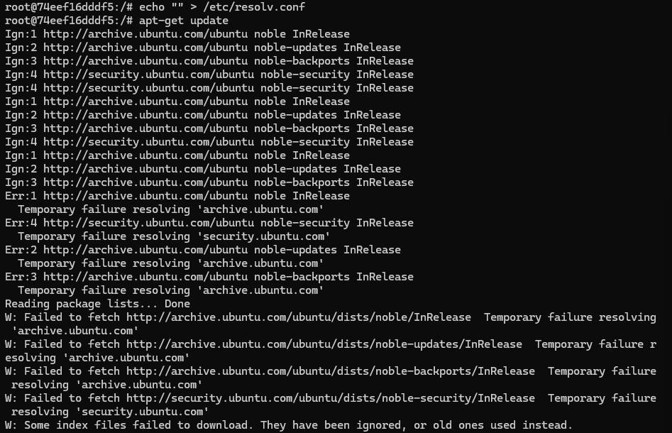
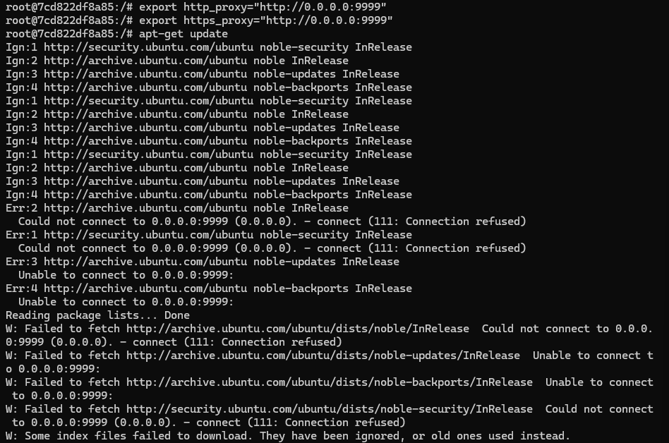

## Конфигурации для блокировки

**Цель**: изнутри контейнера заблокировать ему выход в сеть интернет.

1. Блокировка DNS-резолвинга через ```/etc/resolv.conf```:

Удаляем или затираем DNS-серверы
```
echo "" > /etc/resolv.conf
```
ИЛИ перенаправляем DNS-запросы на несуществующий адрес
```
echo "nameserver 127.0.0.1" > /etc/resolv.conf
```

Объяснение: ```apt-get update``` и другие сетевые операции требуют DNS-резолвинга для преобразования доменных имен в IP-адреса.

Если файл ```/etc/resolv.conf``` пуст или указывает на нерабочий DNS-сервер, команды, зависящие от DNS, перестанут работать.



2. Блокировка через переменные окружения ```http_proxy```:

Устанавливаем нерабочий прокси
```
export http_proxy="http://0.0.0.0:9999"
export https_proxy="http://0.0.0.0:9999"
```

Объяснение: ```apt-get``` и многие другие утилиты используют переменные ```http_proxy/https_proxy``` для выхода в интернет.

Если прокси нерабочий, все запросы будут завершаться ошибкой.

